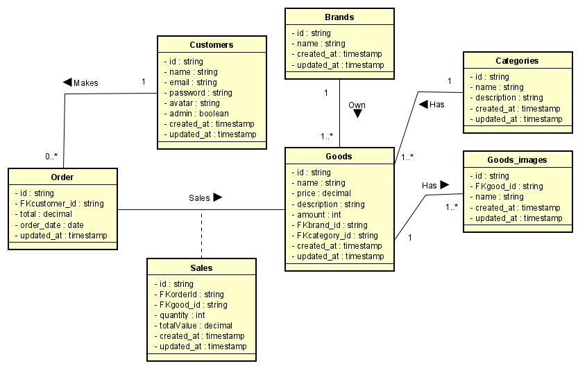

# Amatronic

## Sumário

1. [Informações gerais do projeto](#informacoes-gerais)

2. [Diagrama de Classes](#diagrama-de-classe)

3. [Requisitos da aplicação](#requisitos-aplicacao)

  - [Consumidor](#consumidor)

    - [Cadastro de Consumidor](#cadastro-consumidor)

    - [Autenticação de Consumidor](#autenticacao-consumidor)

    - [Listagem de Consumidores](#listagem-consumidor)

    - [Atualização de Consumidor](#atualizacao-de-consumidor)

    - [Remoção de Consumidor](#remover-consumidor)

  - [Marca](#marca)

    - [Cadastro de uma Marca](#cadastro-marca)

    - [Listagem de Marcas](#listagem-marca)

    - [Atualização de uma Marca](#atualizacao-marca)

    - [Remoção de uma Marca](#remover-marca)

  - [Categoria](#categoria)

    - [Cadastro de uma Categoria](#cadastro-categoria)

    - [Listagem das Categorias](#listagem-categoria)

    - [Atualização de uma Categoria](#atualizacao-categoria)

    - [Remoção de uma Categoria](#remover-categoria)

## Informações gerais do projeto <a name="informacoes-gerais" />

Um e-commerce de dispositivos eletrônicos

## Diagrama de Classes <a name="diagrama-de-classe" />

## Requisitos da aplicação <a name="requisitos-aplicacao" />

### Consumidor <a name="consumidor" />

#### Cadastro de Consumidor <a name="cadastro-consumidor" />

##### Requisitos funcionais

- Deve ser possível cadastrar um novo consumidor

##### Regras de negócio

- Não deve ser possível cadastrar um consumidor com o email já existente
- A senha do consumidor deve ser criptografada

#### Autenticação de Consumidor <a name="autenticacao-consumidor" />

##### Requisitos funcionais

- Deve ser possível autenticar um consumidor

##### Requisitos não funcionais

- Deve ser utilizado o bcrypt para criptografar a senha
- Deve ser utilizado o jsonwebtoken como forma de autenticar

##### Regras de negócio

- Não deve ser possível autenticar com o email incorreto
- Não deve ser possível autenticar com a senha incorreta

#### Listagem de Consumidores <a name="listagem-consumidor" />

##### Requisitos funcionais

- Deve ser possível listar todos os consumidors

##### Regras de negócio

- O consumidor responsável pela listagem deve ser um consumidor administrador.

#### Atualização de Consumidor <a name="atualizacao-de-consumidor" />

##### Requisitos funcionais

- Deve ser possível atualizar os dados de um consumidor

##### Regras de negócio

- O consumidor responsável pela atualização deve estar logado na aplicação
- Não deve ser possível atualizar um consumidor inexistente
- Não deve ser possível a atualização de email do consumidor caso o mesmo já esteja exista

#### Remoção de Consumidor <a name="remover-consumidor" />

##### Requisitos funcionais

- Deve ser possível remover um consumidor

##### Regras de negócio

- O consumidor deve conseguir remover a própria conta
- O consumidor deve estar logado na aplicação

### Marca <a name="marca" />

#### Cadastro de Marca <a name="cadastro-marca" />

##### Requisitos funcionais

- Deve ser possível cadastrar uma nova marca

##### Regras de negócio

- Não deve ser possível cadastrar uma nova marca com o nome já existente
- Somente o administrador deve ser responsável por cadastrar uma marca

#### Listagem de Marcas <a name="listagem-marca" />

##### Requisitos funcionais

- Deve ser possível listar todas as marcas

#### Atualização de Marca <a name="atualizacao-marca" />

##### Requisitos funcionais

- Deve ser possível atualizar os dados de uma marca

##### Regras de negócio

- Somente o administrador deve ser responsável pela atualização de uma marca
- Não deve ser possível atualizar uma marca inexistente
- Não deve ser possível atualizar uma marca com o nome já existente

#### Remoção de Marca <a name="remover-marca" />

##### Requisitos funcionais

- Deve ser possível remover uma marca

##### Regras de negócio

- Somente o administrador deve ser responsável pela remoção de uma marca
- Não deve ser possível remover uma marca inexistente

### Categoria <a name="categoria" />

#### Cadastro de Categoria <a name="cadastro-categoria" />

##### Requisitos funcionais

- Deve ser possível cadastrar uma nova categoria

##### Regras de negócio

- Não deve ser possível cadastrar uma nova categoria com o nome já existente
- Somente o administrador deve ser responsável por cadastrar uma categoria

#### Listagem de Categorias <a name="listagem-categoria" />

##### Requisitos funcionais

- Deve ser possível listar todas as categorias

#### Atualização de Categoria <a name="atualizacao-categoria" />

##### Requisitos funcionais

- Deve ser possível atualizar os dados de uma categoria

##### Regras de negócio

- Somente o administrador deve ser responsável pela atualização de uma categoria
- Não deve ser possível atualizar uma categoria inexistente
- Não deve ser possível atualizar uma categoria com o nome já existente

#### Remoção de Categoria <a name="remover-categoria" />

##### Requisitos funcionais

- Deve ser possível remover uma categoria

##### Regras de negócio

- Somente o administrador deve ser responsável pela remoção de uma categoria
- Não deve ser possível remover uma categoria inexistente

