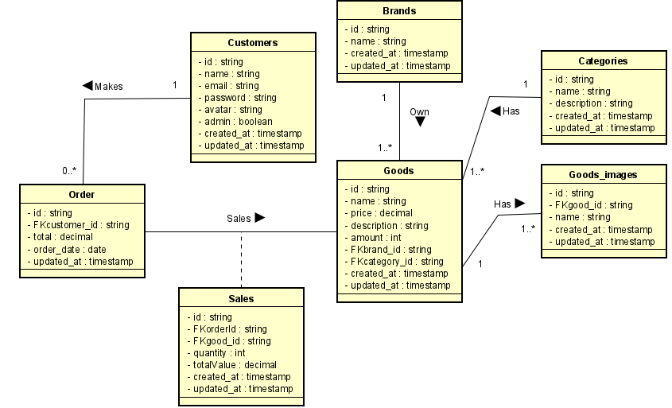

# Amatronic

## Sumário

1. [Informações gerais do projeto](#informacoes-gerais)

2. [Diagrama de Classes](#diagrama-de-classe)

3. [Requisitos da aplicação](#requisitos-aplicacao)

   3.1. [Cadastro de Consumidor](#cadastro-consumidor)

   3.2. [Listagem de Consumidores](#listagem-consumidor)

   3.3. [Atualização de Consumidor](#atualizacao-de-consumidor)

   3.4. [Remoção de Consumidor](#remover-consumidor)

## Informações gerais do projeto <a name="informacoes-gerais" />

Um e-commerce de dispositivos eletrônicos

## Diagrama de Classes <a name="diagrama-de-classe" />

## Requisitos da aplicação <a name="requisitos-aplicacao" />

### Cadastro de Consumidor <a name="cadastro-consumidor" />

#### Requisitos funcionais

- Deve ser possível cadastrar um novo consumidor

#### Regras de negócio

- Não deve ser possível cadastrar um consumidor com o email já existente
- A senha do consumidor deve ser criptografada

### Listagem de Consumidores <a name="listagem-consumidor" />

#### Requisitos funcionais

- Deve ser possível listar todos os consumidors

#### Regras de negócio

- O consumidor responsável pela listagem deve ser um consumidor administrador.

### Atualização de Consumidor <a name="atualizacao-de-consumidor" />

#### Requisitos funcionais

- Deve ser possível atualizar os dados de um consumidor

#### Regras de negócio

- O consumidor responsável pela atualização deve estar logado na aplicação
- Não deve ser possível atualizar um consumidor inexistente
- Não deve ser possível a atualização de email do consumidor caso o mesmo já esteja exista

### Remoção de Consumidor <a name="remover-consumidor" />

#### Requisitos funcionais

- Deve ser possível remover um consumidor

#### Regras de negócio

- O consumidor responsável pela remoção deve estar logado na aplicação
- Não deve ser possível remover um consumidor inexistente

